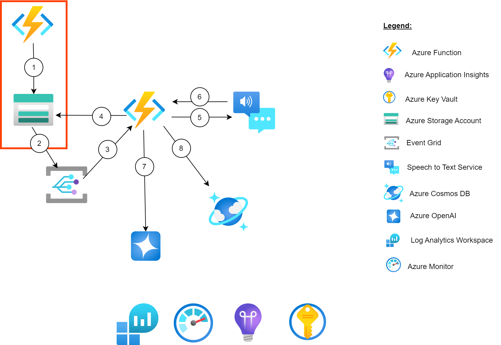

# Build serverless intelligent Apps with Azure Functions Flex Consumption and extension for OpenAI


Welcome to this Azure Functions Workshop. You'll be experimenting with Azure Functions service in multiple labs to achieve a real world scenario. We will use the Azure Functions Flex consumption plan for all of these labs which contains the latest features of Azure Functions. Don't worry, even if the challenges will increase in difficulty, this is a step by step lab, you will be guided through the whole process.

During this workshop you will have the instructions to complete each steps. It is recommended to search for the answers in provided resources and links before looking at the solutions placed under the '📚 Toggle solution' panel.

<div class="task" data-title="Task">

> - You will find the instructions and expected configurations for each Lab step in these yellow **TASK** boxes.
> - Inputs and parameters to select will be defined, all the rest can remain as default as it has no impact on the scenario.
>
> - Log into your Azure subscription locally using Azure CLI and on the [Azure Portal][az-portal] using your own credentials.
> - Instructions and solutions will be given for the Azure CLI, but you can also use the Azure Portal if you prefer.

</div>


## Scenario

The goal of the full lab is to upload an audio file to Azure and save the transcripts back inside a Cosmos DB database and enrich these transcriptions with a summary using Azure OpenAI. The scenario is as follows:


1. You will use Azure Load Testing to be able to simulate the traffic on your system
1. All requests will go through APIM (API Management). This includes the requests for fetching transcriptions and for uploading audio files.
1. The first Azure Function (standard function) will be mainly responsible for uploading the audio file to the Storage Account.
1. Whenever a blob is uploaded to the Storage Account, a `BlobCreated` event will be emitted to Event Grid
1. The Event Grid System Topic will push the event (in real time) to trigger the Azure Durable Function
1. The Azure Durable Function will start processing the audio file
1. The Azure Durable Function will use the Speech To Text service for audio transcription. It will use the Monitor pattern to check every few seconds if the transcription is done.
1. The Azure Durable Function will retrieve the transcription from the Speech to Text service
1. The Azure Durable Function will use Azure OpenAI to generate a summary of the audio file from the transcription
1. The Azure Durable Function will then store the transcription and its summary in Cosmos DB

You will also learn:
- How to use managed identity to secure the access to Azure services.
- How to monitor and observe Azure Functions

## 🔑 Sign in to Azure

<div class="task" data-title="Task">

> - Log into your Azure subscription in your environment using Azure CLI and on the [Azure Portal][az-portal] using your credentials.
> - Instructions and solutions will be given for the Azure CLI, but you can also use the Azure Portal if you prefer.

</div>

<details>

<summary>📚 Toggle solution</summary>

```bash
# Login to Azure : 
# --tenant : Optional | In case your Azure account has access to multiple tenants
# The tenant id can be easily find by searching for "Tenant properties" in the search bar of the Azure Portal.

# Option 1 : Local Environment or Dev Container
az login --tenant <your-tenant-id or domain.com>
# Option 2 : Github Codespace : you might need to specify --use-device-code parameter to ease the az cli authentication process
az login --use-device-code --tenant <your-tenant-id or domain.com>

# Display your account details
az account show
# Select your Azure subscription
az account set --subscription <subscription-id>
```

</details>

[az-cli-install]: https://learn.microsoft.com/en-us/cli/azure/install-azure-cli
[az-func-core-tools]: https://learn.microsoft.com/en-us/azure/azure-functions/functions-run-local?tabs=v4%2Clinux%2Ccsharp%2Cportal%2Cbash#install-the-azure-functions-core-tools
[az-func-languages]: https://learn.microsoft.com/en-us/azure/azure-functions/functions-versions#languages
[azure-function-vs-code-extension]: https://marketplace.visualstudio.com/items?itemName=ms-azuretools.vscode-azurefunctions
[az-portal]: https://portal.azure.com
[github-account]: https://github.com/join
[git-client]: https://git-scm.com/downloads
[repo-fork]: https://github.com/microsoft/hands-on-lab-azure-functions/fork
[vs-code]: https://code.visualstudio.com/

---

# Lab 1 : Upload an audio file

For this first lab, you will focus on the following scope :



The Azure Storage Account will be used to store the audios files inside the `audios` container.

To check that everything was created as expected, open the [Azure Portal][az-portal] and select the storage account which is **not** starting with `stfstd` or `stfdrbl` those two are for the two Azure Functions.

In the third one, you should retrieve your `audios` container:


## A bit of theory

### Azure Functions

Azure Functions is a `compute-on-demand` solution, offering a common function programming model for various languages. To use this serverless solution, no need to worry about deploying and maintaining infrastructures, Azure provides with the necessary up-to-date compute resources needed to keep your applications running. Focus on your code and let Azure Functions handle the rest.

Azure Functions are event-driven : They must be triggered by an event coming from a variety of sources. This model is based on a set of `triggers` and `bindings` which let you avoid hard-coding access to other services. Your function receives data (for example, the content of a queue message) in function parameters. You send data (for example, to create a queue message) by using the return value of the function :

- `Binding` to a function is a way of connecting another resource to the function in a declarative way; bindings can be used to fetch data (input bindings), write data (output bindings), or both. Azure services such as Azure Storage blobs and queues, Service Bus queues, Event Hubs, and Cosmos DB provide data to the function as parameters.
- `Triggers` are a specific kind of binding that causes a function to run. A trigger defines how a function is invoked, and a function must have exactly one trigger. Triggers have associated data, which is often provided as a parameter payload to the function.

In the same `Function App` you will be able to add multiple `functions`, each with its own set of triggers and bindings. These triggers and bindings can benefit from existing `expressions`, which are parameter conventions easing the overall development experience. For example, you can use an expression to use the execution timestamp, or generate a unique `GUID` name for a file uploaded to a storage account.

Azure Functions run and benefit from the App Service platform, offering features like: deployment slots, continuous deployment, HTTPS support, hybrid connections and others. Apart from the `Flex Consumption` (Serverless) model we're most interested in this Lab, Azure Functions can also be deployed a dedicated `Consumption`, `App Service Plan` or in a hybrid model called `Premium Plan`.

### Managed identities

Security is our first concern at Microsoft. To avoid any credential management issues, the best practice is to use managed identities on Azure. They offer several key benefits:

- **Enhanced Security**: Managed identities eliminate the need to store credentials in your code, reducing the risk of accidental leaks or breaches.
- **Simplified Credential Management**: Azure automatically handles the lifecycle of these identities, so you don’t need to manually manage secrets, passwords, or keys.
- **Seamless Integration**: Managed identities can authenticate to any Azure service that supports Microsoft Entra ID authentication, making it easier to connect and secure your applications.
- **Cost Efficiency**: There are no additional charges for using managed identities, making it a cost-effective solution for securing your Azure resources.

In this workshop, you will only be using Managed Identities to secure service-to-service communications.

### .NET 8 implementation

In this version of the implementation, you will be using the [.NET 8 Isolated][in-process-vs-isolated] runtime.

Now that you have a skeleton for our `AudioUpload` function in the `AudioUpload.cs` file, you will need to update it to meet the following goals:

- It should read the uploaded file from the body of the POST request
- It should store the file as a blob inside the blob Storage Account
- It should respond to user with a status code 200

To upload the file, you will rely on the blob output binding [`BlobOutput`][blob-output] of the Azure Function, which will take care of the logic of connecting to the Storage Account and uploading the function with minimal line of code in our side.

To do this, let's start by adding a `AudioUploadOutput` class to the `AudioUpload.cs` file.
For simplicity reasons you will be reusing the existing file to add the class, but keep in mind that you can also opt for adding it in its own dedicated file.

```csharp
public class AudioUploadOutput
{
    [BlobOutput("%STORAGE_ACCOUNT_CONTAINER%/{rand-guid}.wav", Connection = "AudioUploadStorage")]
    public byte[] Blob { get; set; }

    public required IActionResult HttpResponse { get; set; }
}
```

This class will handle uploading the blob and returning the HTTP response:

- The blob will be stored in the container identified by `STORAGE_ACCOUNT_CONTAINER` which is an environment variable.
- The blob will be named `{rand-guid}.wav` which resolves to a UUID followed by `.wav`.
- `AudioUploadStorage` is the name of the prefix in the App setting which will be used to connect to the blob storage account using a managed identity. Behind the scenes the Azure Function will fetch the app setting called `AudioUploadStorage__serviceUri` and use it to connect to the Storage Account where audio files are uploaded. 

In fact if you open the Azure Function App resource started with `func-std` in the [Azure Portal][az-portal] and go to the `Environment variables` panel. You should see in App Settings the `STORAGE_ACCOUNT_CONTAINER` set to `audios` and another entry called `AudioUploadStorage__serviceUri` used to locate the storage account.

As part of the workshop, the `Storage Blob Data Owner` was already assigned to your Azure Function's managed identity. This role together with the `AudioUploadStorage__serviceUri` environment variable will allow the function to access the Storage account securely without needing to use a connection string.

Next, you will need to update the class `AudioUpload` to add the logic for reading the file from the request, and then use `AudioUploadOutput` to perform the blob upload and returning the response.

Update the code of the `Run` method in the `AudioUpload` class as follows:

```csharp
[Function(nameof(AudioUpload))]
public AudioUploadOutput Run(
    [HttpTrigger(AuthorizationLevel.Anonymous, "post")] HttpRequest req
)
{
    _logger.LogInformation("Processing a new audio file upload request");

    // Get the first file in the form
    byte[]? audioFileData = null;
    var file = req.Form.Files[0];

    using (var memstream = new MemoryStream())
    {
        file.OpenReadStream().CopyTo(memstream);
        audioFileData = memstream.ToArray();
    }

    // Store the file as a blob and return a success response
    return new AudioUploadOutput()
    {
        Blob = audioFileData,
        HttpResponse = new OkObjectResult("Uploaded!")
    };
}
```

## Testing locally

### Run the function locally

Add the following environment variables to your `local.settings.json` file:

```json
{
  "IsEncrypted": false,
  "Values": {
    "AzureWebJobsStorage": "UseDevelopmentStorage=true",
    "FUNCTIONS_WORKER_RUNTIME": "dotnet-isolated",
    "STORAGE_ACCOUNT_CONTAINER": "audios",
    "AudioUploadStorage": "UseDevelopmentStorage=true"
  }
}
```

To test your function locally, you will need to start the extension `Azurite` to emulate the Azure Storage Account. Just run `Ctrl` + `Shift` + `P` and search for `Azurite: Start`:


Then you can use the Azure Function Core Tools to run the function locally:

```bash
func start
```

if you have an error such as:

> Can't determine Project to build. Expected 1 .csproj or .fsproj but found 2

Just remove the bin and obj folder and run the command again, the issue is currently being corrected.

```bash
rm -rf bin/ && rm -rf obj/ && func start
```

<div class="tip" data-title="Tips">

> - If you are using Github Codespaces for testing, and you encounter authentication issues (e.g. 401) or infinite loop, then first make sure the visibility of the port `7071` is either set to "Public" or that you are passing a valid Github token in the `X-Github-Token` header.
> - Please refer to this [port forwarding guide on Github Codespaces](https://docs.github.com/en/codespaces/developing-in-a-codespace/forwarding-ports-in-your-codespace#using-command-line-tools-and-rest-clients-to-access-ports) for more details.
> - If you are using a DevContainer, look at the forwarded address in the port tab of VS Code.

</div>

### Upload an audio file

Upload an audio file to Azurite's blob storage using the function running locally.

To do that you can use one of the sample audio files provided in the workshop:

- [Microsoft AI](assets/audios/MicrosoftAI.wav)
- [Azure Functions](assets/audios/AzureFunctions.wav)

Next, run the following command to upload the audio file. You can also use Postman or another HTTP client if you have previously opted for using a dev container or a local dev environment.

```sh
curl -v -F audio=@docs/assets/audios/MicrosoftAI.wav http://localhost:7071/api/AudioUpload
```

### Check blob creation

Finally, make sure that the audio file was saved in Azurite as a blob with the name `[GUID].wav`.

We will use the [Azure Storage extension][azure-storage-extension] to list available blobs in the `audios` container in Azurite (Local Emulator):


You can repeat the same test commands to ensure new files get saved in Azurite whenever you upload a file using the function running locally.

## Deployment to Azure

### Option 1 : Deploy your function with VS Code

- Open the Azure extension in VS Code left panel
- Make sure you're signed in to your Azure account
- Open the Function App panel
- Right-click on your function app and select `Deploy to Function App...`
- Select the Function starting with `func-std-`


### Option 2 : Deploy your function with the Azure Function Core Tools

Deploy your function using the VS Code extension or via command line:

```bash
# Inside the FuncStd folder run the following command:
func azure functionapp publish func-std-<your-instance-suffix-name>
```

## Test the Function App deployed in Azure

Let's give the new function a try using [Postman][postman]. Go to the Azure Function and select `Functions` then `AudioUpload` and select the `Get Function Url` with the `default (function key)`.
The Azure Function url is protected by a code to ensure a basic security layer. 


Use this url with Postman to upload the audio file.

You can use the provided sample audio files to test the function:

- [Microsoft AI](assets/audios/MicrosoftAI.wav)
- [Azure Functions](assets/audios/AzureFunctions.wav)

Create a POST request and in the row where you set the key to `audio` for instance then, make sure to select the `file` option in the hidden dropdown menu to be able to select a file in the value field:


Go back to the Storage Account and check the `audios` container. You should see the files that you uploaded with your `AudioUpload` Azure Function!

</details>


## Lab 1 : Summary

By now you should have a solution which stores uploaded audio files within a blob storage using a first Azure Function. Audio files are stored inside an `audios` container.

The first Azure Function API created in the Lab offers a first security layer to the solution as it requires a key to be called, as well as makes sure all the files are stores with a uniquely generated name (GUID). We will go further in the next labs.

[az-portal]: https://portal.azure.com
[azure-function]: https://learn.microsoft.com/en-us/cli/azure/functionapp?view=azure-cli-latest
[azure-function-core-tools]: https://learn.microsoft.com/en-us/azure/azure-functions/functions-run-local?tabs=v4%2Cwindows%2Ccsharp%2Cportal%2Cbash
[azure-function-basics]: https://learn.microsoft.com/en-us/azure/azure-functions/supported-languages
[azure-function-http]: https://learn.microsoft.com/en-us/azure/azure-functions/functions-bindings-http-webhook-trigger?pivots=programming-language-python&tabs=python-v2%2Cin-process%2Cfunctionsv2
[azure-function-blob-output]: https://learn.microsoft.com/en-us/azure/azure-functions/functions-bindings-storage-blob-output?pivots=programming-language-python&tabs=python-v2%2Cin-process
[azure-function-bindings-expression]: https://learn.microsoft.com/en-us/azure/azure-functions/functions-bindings-expressions-patterns
[in-process-vs-isolated]: https://learn.microsoft.com/en-us/azure/azure-functions/dotnet-isolated-in-process-differences
[blob-output]: https://learn.microsoft.com/en-us/azure/azure-functions/functions-bindings-storage-blob-output?tabs=python-v2%2Cin-process&pivots=programming-language-csharp
[azure-managed-identity]: https://learn.microsoft.com/en-us/azure/azure-functions/functions-bindings-storage-blob-output?tabs=python-v2%2Cisolated-process%2Cnodejs-v4&pivots=programming-language-csharp#identity-based-connections
[azure-storage-extension]: https://marketplace.visualstudio.com/items?itemName=ms-azuretools.vscode-azurestorage#:~:text=Installation.%20Download%20and%20install%20the%20Azure%20Storage%20extension%20for%20Visual
[postman]: https://www.postman.com/

---

# Lab 2 : Process the audio file with an Azure Durable Function

On this lab, you will focus on the following scope :


Processing the audio file involves the following actions:
- Detecting file uploads
- Creating a transcript of the file
- Saving the transcript to Azure Cosmos DB
- Generating a summary with Azure OpenAI

To ensure the execution of all these steps and to orchestrate all of this process, you will need to create a Durable Function.
Durable Function is an extension of Azure Functions that lets you write stateful functions in a serverless environment. The extension manages state, checkpoints, and restarts for you.

## Detect a file upload event 

### Listen to the audio upload

Now, you have the audio file uploaded in the storage account, you will need to detect this event to trigger the next steps of the scenario.

<div class="task" data-title="Tasks">

> - Create a new `Durable Function` with a `Blob Trigger` to detect the file upload event based on Event Grid and start the processing of the audio file.
>
> - Use the `func` CLI tool and .NET 8 using the isolated mode to create this Durable Function.
> - Use the `Audio.cs` file below to instantiate an `AudioFile` object when the Azure Function is triggered.
> - Create an `AudioTranscriptionOrchestration.cs` file which will be used to create the orchestration of the entire Azure Function.
> - Generate a URI with a SAS token to access the blob storage.
> - Add an Event Grid subscription to detect the upload of audios in real time.

</div>

<div class="tip" data-title="Tips">

> - [Azure Functions][azure-function]<br>
> - [Azure Functions Binding Expressions][azure-function-bindings-expression]<br>
> - [Azure Function Blob Triggered][azure-function-blob-trigger]<br>
> - [Azure Function Blob Trigger with Event Grid][blob-trigger-event-grid]<br>

</div>

The `Audio.cs` file will be used to create an `AudioFile` object and also an `AudioTranscription` object when the transcription is done, this will be used to store the data in Cosmos DB in the next step.

<details>
<summary>📄 Audio.cs</summary>

```csharp
using System.Text.Json.Serialization;

namespace FuncDurable
{
    public abstract class Audio
    {
        [JsonPropertyName("id")]
        public string Id { get; set; }
        
        // Blob path uri
        [JsonPropertyName("path")]
        public string Path { get; set; }
    }

    public class AudioFile : Audio
    {
        [JsonPropertyName("urlWithSasToken")]
        public string UrlWithSasToken { get; set; }

        [JsonPropertyName("jobUri")]
        public string? JobUri { get; set; }
    }

    public class AudioTranscription : Audio
    {
        [JsonPropertyName("result")]
        public string Result { get; set; }

        [JsonPropertyName("status")]
        public string Status { get; set; }

        [JsonPropertyName("completion")]
        public string? Completion { get; set; }
    }
}
```
</details>

## Consume Speech to Text APIs

The Azure Cognitive Services are cloud-based AI services that give the ability to developers to quickly build intelligent apps thanks to these pre-trained models. They are available through client library SDKs in popular development languages and REST APIs.

Cognitive Services can be categorized into five main areas:

- Decision: Content Moderator provides monitoring for possible offensive, undesirable, and risky content. Anomaly Detector allows you to monitor and detect abnormalities in your time series data.
- Language: Azure Language service provides several Natural Language Processing (NLP) features to understand and analyze text.
- Speech: Speech service includes various capabilities like speech to text, text to speech, speech translation, and many more.
- Vision: The Computer Vision service provides you with access to advanced cognitive algorithms for processing images and returning information.
- Azure OpenAI Service: Powerful language models including the GPT-3, GPT-4, Codex and Embeddings model series for content generation, summarization, semantic search, and natural language to code translation.

You now want to retrieve the transcript out of the audio file uploaded thanks to the speech to text cognitive service.

<div class="task" data-title="Tasks">

> - Because the transcription can be a long process, you will use the monitor pattern of the Azure Durable Functions to call the speech to text batch API and check the status of the transcription until it's done.
>
> - Use the `SpeechToTextService.cs` file and the `Transcription.cs` model provided below to get the transcription.
> - A skeleton of the orchestration part will be provided below.
> - Instantiate an `AudioTranscription` object when the transcription is done, this will be used to store the data in Cosmos DB in the next step.
> - Do not forget to start the orchestration in the `AudioBlobUploadStart` function.

</div>

<div class="tip" data-title="Tips">

> - [What are Cognitive Services][cognitive-services]<br>
> - [Cognitive Service Getting Started][cognitive-service-api]<br> 
> - [Batch endpoint Speech to Text API][speech-to-text-batch-endpoint]<br>
> - [Monitor pattern Durable Function][monitor-pattern-durable-functions]<br>

</div>

This is the definition of the `Transcription.cs` file:

<details>
<summary>📄 AudioTranscriptionOrchestration.cs</summary>

```csharp
[Function(nameof(AudioTranscriptionOrchestration))]
public static async Task RunOrchestrator(
    [OrchestrationTrigger] TaskOrchestrationContext context, 
    AudioFile audioFile)
{
    ILogger logger = context.CreateReplaySafeLogger(nameof(AudioTranscriptionOrchestration));
    if (!context.IsReplaying) { logger.LogInformation($"Processing audio file {audioFile.Id}"); }

    // Step1: TODO: Start transcription
    

    DateTime endTime = context.CurrentUtcDateTime.AddMinutes(2);

    while (context.CurrentUtcDateTime < endTime)
    {
        // Step2: TODO: Check if transcription is done
        
        if (!context.IsReplaying) { logger.LogInformation($"Status of the transcription of {audioFile.Id}: {status}"); }

        if (status == "Succeeded" || status == "Failed")
        {
            // Step3: TODO: Get transcription
            

            // Step4: TODO: Enrich the transcription

            if (!context.IsReplaying) { logger.LogInformation($"Enrich transcription of {audioFile.Id} to Cosmos DB"); }

            // Step5: TODO: Save transcription

            if (!context.IsReplaying) { logger.LogInformation($"Save transcription, finishing processing of {audioFile.Id}"); }

            break;
        }
        else
        {
            // Wait for the next checkpoint
            var nextCheckpoint = context.CurrentUtcDateTime.AddSeconds(5);
            if (!context.IsReplaying) { logger.LogInformation($"Next check for {audioFile.Id} at {nextCheckpoint}."); }

            await context.CreateTimer(nextCheckpoint, CancellationToken.None);
        }
    }
}

[Function(nameof(StartTranscription))]
public static async Task<string> StartTranscription([ActivityTrigger] AudioFile audioFile, FunctionContext executionContext)
{
    // TODO: Call the Speech To Text service to create a batch transcription
}


[Function(nameof(CheckTranscriptionStatus))]
public static async Task<string> CheckTranscriptionStatus([ActivityTrigger] AudioFile audioFile, FunctionContext executionContext)
{
    // TODO: Call the Speech To Text service to check the status of the transcription
}


[Function(nameof(GetTranscription))]
public static async Task<string?> GetTranscription([ActivityTrigger] AudioFile audioFile, FunctionContext executionContext)
{
    // TODO: Call the Speech To Text service to get the transcription
}

[Function(nameof(EnrichTranscription))]
public static AudioTranscription EnrichTranscription([ActivityTrigger] AudioTranscription audioTranscription, FunctionContext executionContext)
{
    ILogger logger = executionContext.GetLogger(nameof(EnrichTranscription));
    logger.LogInformation($"Enriching transcription {audioTranscription.Id}");      
    return audioTranscription;
}
```

</details>

<details>
<summary>📚 Toggle solution</summary>

First, you need to start the orchestration of the transcription of the audio file in the `AudioBlobUploadStart` function you did previously by adding this code at the end:

```csharp
string instanceId = await client.ScheduleNewOrchestrationInstanceAsync(nameof(AudioTranscriptionOrchestration), audioFile);

logger.LogInformation("Started orchestration with ID = '{instanceId}'.", instanceId);
```

The `ScheduleNewOrchestrationInstanceAsync` will start the orchestration of the transcription of the audio file.

Then you will need to implement the different steps of the orchestration in the `AudioTranscriptionOrchestration.cs` file.

Let's start with the `StartTranscription` function:

```csharp
ILogger logger = executionContext.GetLogger(nameof(StartTranscription));
logger.LogInformation($"Starting transcription of {audioFile.Id}");

var jobUri = await SpeechToTextService.CreateBatchTranscription(audioFile.UrlWithSasToken, audioFile.Id);

logger.LogInformation($"Job uri for {audioFile.Id}: {jobUri}");

return jobUri;
```

The goal here is to create a batch transcription using the `SpeechToTextService` and retrieve the job URI of the transcription. This job URI will be used to check the status of the transcription and get the transcription itself.

Then you will need to implement the `CheckTranscriptionStatus` function:

```csharp
ILogger logger = executionContext.GetLogger(nameof(CheckTranscriptionStatus));
logger.LogInformation($"Checking the transcription status of {audioFile.Id}");
var status = await SpeechToTextService.CheckBatchTranscriptionStatus(audioFile.JobUri!);
return status;
```

This function will check the status of the transcription using the `SpeechToTextService` and return the status.

Finally, you will need to implement the `GetTranscription` function:

```csharp
ILogger logger = executionContext.GetLogger(nameof(GetTranscription));
var transcription = await SpeechToTextService.GetTranscription(audioFile.JobUri!);
logger.LogInformation($"Transcription of {audioFile.Id}: {transcription}");
return transcription;
```

This function will get the transcription of the audio file using the `SpeechToTextService` and return the transcription.

As you probably noticed, each function use his own logger to log the different steps of the orchestration. This will help you to debug the orchestration if needed.

So far so good, you have all the functions needed to orchestrate the transcription of the audio file. The idea now is to call those functions in the orchestration part of the `AudioTranscriptionOrchestration.cs` file.

Each of those functions (`StartTranscription`, `CheckTranscriptionStatus` and `GetTranscription`) will be called in the orchestration part as an activity.

For the `Step1` you just need to call the `StartTranscription` function:

```csharp
var jobUri = await context.CallActivityAsync<string>(nameof(StartTranscription), audioFile);
audioFile.JobUri = jobUri;
```

For the `Step2` you will need to call the `CheckTranscriptionStatus` function to get the status of the transcription:

```csharp
var status = await context.CallActivityAsync<string>(nameof(CheckTranscriptionStatus), audioFile);
```

For the `Step3` you will need to call the `GetTranscription` function and create the `AudioTranscription` object to store the data in Cosmos DB in the next step:

```csharp
string transcription = await context.CallActivityAsync<string>(nameof(GetTranscription), audioFile);

if (!context.IsReplaying) { logger.LogInformation($"Retrieved transcription of {audioFile.Id}: {transcription}"); }

var audioTranscription = new AudioTranscription
{
    Id = audioFile.Id,
    Path = audioFile.Path,
    Result = transcription,
    Status = status
};
```

The  `SPEECH_TO_TEXT_ENDPOINT` and the `SPEECH_TO_TEXT_API_KEY` environment variables are already set on Azure for you, if you look at the environment variable of your function you will see that for security reason the `SPEECH_TO_TEXT_API_KEY` is referring a Key Vault where the key is.

</details>

## Store data to Cosmos DB

Azure Cosmos DB is a fully managed NoSQL database which offers Geo-redundancy and multi-region write capabilities. It currently supports NoSQL, MongoDB, Cassandra, Gremlin, Table and PostgreSQL APIs and offers a serverless option which is perfect for our use case.

You now have a transcription of your audio file, next step is to store it in a NoSQL database inside Cosmos DB.

<div class="task" data-title="Tasks">

> - Create a new `Activity Function` called `SaveTranscription` to store the transcription of the audio file in Cosmos DB.
> - Use the `CosmosDBOutput` binding to store the data in the Cosmos DB.
> - Store the `AudioTranscription` object in the Cosmos DB container called `audios_transcripts`.
> - Call the activity from the orchestration part.
> - Use manage identity to connect to Cosmos DB. 

</div>

<div class="tip" data-title="Tips">

> - [Serverless Cosmos DB][cosmos-db]<br>
> - [Cosmos DB Output Binding][cosmos-db-output-binding]

</div>

<details>
<summary>📚 Toggle solution</summary>

Because you need to connect to Azure Cosmos DB with the `CosmosDBOutput` binding you need to first add the associated Nuget Package:

```bash
dotnet add package Microsoft.Azure.Functions.Worker.Extensions.CosmosDB --version 4.9.0
```

Then to store the transcription of the audio file in Cosmos DB, you will need to create a new `Activity Function` called `SaveTranscription` in the `AudioTranscriptionOrchestration.cs` file and apply the `CosmosDBOutput` binding to store the data in the Cosmos DB:

```csharp
[Function(nameof(SaveTranscription))]
[CosmosDBOutput("%COSMOS_DB_DATABASE_NAME%",
                    "%COSMOS_DB_CONTAINER_ID%",
                    Connection = "COSMOS_DB",
                    CreateIfNotExists = true)]
public static AudioTranscription SaveTranscription([ActivityTrigger] AudioTranscription audioTranscription, FunctionContext executionContext)
{
    ILogger logger = executionContext.GetLogger(nameof(SaveTranscription));
    logger.LogInformation("Saving the audio transcription...");

    return audioTranscription;
}
```

As you can see, by just defining the binding, the Azure Function will take care of storing the data in the Cosmos DB container, so you just need to return the object you want to store, in this case, the `AudioTranscription` object.

To be able to connect the Azure Function to the Cosmos DB, you have the `COSMOS_DB_DATABASE_NAME`, the `COSMOS_DB_CONTAINER_ID` and the `COSMOS_DB` environment variables. The `COSMOS_DB` will be the connection key that will be concatenated with `__accountEndpoint` to specify the Cosmos DB account endpoint so it will be able to connect using Managed identity.

Those environment variables are already set in the Azure Function App settings (`func-drbl-<your-instance-name>`) when you deployed the infrastructure previously.

Now you just need to call the `SaveTranscription` function in the orchestration part of the `AudioTranscriptionOrchestration.cs` file:

```csharp
// Step5: Save transcription
await context.CallActivityAsync(nameof(SaveTranscription), audioTranscription);

if (!context.IsReplaying) { logger.LogInformation($"Save transcription, finishing processing of {audioFile.Id}"); }
```

</details>

#### Deployment and testing

You can now redeploy your function and upload an audio file to see if the transcription is stored in the Cosmos DB container and check the logs to see the different steps of the orchestration.

Deploy the Azure Durable Function using the same method as before but with the new function starting with `func-drbl-<your-instance-suffix-name>`.

If the deployment succeed you should see the new function in the Azure Function App:


You can now validate the entire workflow : delete and upload once again the audio file. You should see the new item created above in your Cosmos DB container:


## Lab 2 : Summary

By now you should have a solution that :

- Invoke the execution of an Azure Durable Function responsible for retrieving the audio transcription thanks to a Speech to Text (Cognitive Service) batch processing call.
- Once the transcription is retrieved, the Azure Durable Function store this value in a Cosmos DB database.

[azure-function]: https://learn.microsoft.com/en-us/cli/azure/functionapp?view=azure-cli-latest
[azure-function-bindings-expression]: https://learn.microsoft.com/en-us/azure/azure-functions/functions-bindings-expressions-patterns
[azure-function-blob-trigger]: https://learn.microsoft.com/en-us/azure/azure-functions/functions-bindings-storage-blob-trigger?tabs=python-v2%2Cisolated-process%2Cnodejs-v4%2Cextensionv5&pivots=programming-language-csharp
[speech-to-text-batch-endpoint]: https://learn.microsoft.com/en-us/azure/ai-services/speech-service/batch-transcription-audio-data?tabs=portal
[monitor-pattern-durable-functions]: https://learn.microsoft.com/en-us/azure/azure-functions/durable/durable-functions-monitor?tabs=csharp
[cognitive-services]: https://learn.microsoft.com/en-us/azure/cognitive-services/what-are-cognitive-services
[cosmos-db-output-binding]: https://learn.microsoft.com/en-us/azure/azure-functions/functions-bindings-cosmosdb-v2-output?tabs=python-v2%2Cisolated-process%2Cnodejs-v4%2Cextensionv4&pivots=programming-language-csharp
[cognitive-service-api]: https://learn.microsoft.com/en-us/azure/ai-services/speech-service/rest-speech-to-text-short#regions-and-endpoints
[cosmos-db]: https://learn.microsoft.com/en-us/azure/cosmos-db/scripts/cli/nosql/serverless
[blob-trigger-event-grid]: https://learn.microsoft.com/en-us/azure/azure-functions/functions-event-grid-blob-trigger?pivots=programming-language-csharp

---

# Lab 3 : Use Azure Functions with Azure OpenAI

In this lab you will use Azure Functions to call the Azure OpenAI service to analyze the transcription of the audio file and add some information to the Cosmos DB entry.

You will go back to the Azure Durable Function you did in the previous lab and add a connection to Azure OpenAI to be able to summarize the transcription you saved.

So the scope of the lab is this one:


## Setup for Azure OpenAI

### Add the role to the Azure Function App

The Azure Function App will also need the role of `Cognitive Services OpenAI User` to be able to call the Azure OpenAI service using managed identities.

This role was already assigned to your Azure Function when it was provisioned at the beginning of the lab.

<div class="task" data-title="Tasks">

> - Ensure the Durable function app has the required permissions to consume Azure OpenAI

</div>

<details>
<summary>📚 Toggle solution</summary>

You can confirm this by going to your Azure OpenAI service and in the **Access control (IAM)** section click on the **Role assignment** table and locate the `Cognitive Services OpenAI User` role (you can directly filter assignments by role).

You should see that the Durable function's Function App has the role `Cognitive Services OpenAI User`.

</details>


## Enrich the transcription with Azure OpenAI

<div class="task" data-title="Tasks">

> - Update the Activity function `EnrichTranscription` inside the `AudioTranscriptionOrchestration.cs` to call Azure OpenAI via `TextCompletionInput`
> - Use the result to update the `Completion` field of the transcription.

</div>

<details>
<summary>📚 Toggle solution</summary>

First, you need to add the `TextCompletionInput` binding to the `EnrichTranscription` method:

```csharp
[Function(nameof(EnrichTranscription))]
public static AudioTranscription EnrichTranscription(
    [ActivityTrigger] AudioTranscription audioTranscription, FunctionContext executionContext,
    [TextCompletionInput("Summarize {Result}", Model = "%CHAT_MODEL_DEPLOYMENT_NAME%")] TextCompletionResponse response
)
```

Make sure to add the following `using` to be able to use the `TextCompletionInput` attribute:

```csharp
using Microsoft.Azure.Functions.Worker.Extensions.OpenAI.TextCompletion;
```

This will be managed for you the authentication to the Azure OpenAI service and send the transcription to the service to get a summary of the transcription.

Then you just have to consume the `Content` property of the response object and update the `Completion` field of the `AudioTranscription` object:

```csharp
audioTranscription.Completion = response.Content;
```

And that's it, you have now enriched the transcription of the audio file with the Azure OpenAI service!

So, to summarize, the function will look like this:

```csharp
[Function(nameof(EnrichTranscription))]
public static AudioTranscription EnrichTranscription(
    [ActivityTrigger] AudioTranscription audioTranscription, FunctionContext executionContext,
    [TextCompletionInput("Summarize {Result}", Model = "%CHAT_MODEL_DEPLOYMENT_NAME%")] TextCompletionResponse response
)
{
    ILogger logger = executionContext.GetLogger(nameof(EnrichTranscription));
    logger.LogInformation($"Enriching transcription {audioTranscription.Id}");
    audioTranscription.Completion = response.Content;
    return audioTranscription;
}
```

Finally, update the step 4 and 5 from the `RunOrchestrator` method in the `AudioTranscriptionOrchestration.cs` to trigger the activity of enrichment of the transcription before saving the result to the Cosmos DB:

```csharp
// Step4: Enrich the transcription
AudioTranscription enrichedTranscription = await context.CallActivityAsync<AudioTranscription>(nameof(EnrichTranscription), audioTranscription);

if (!context.IsReplaying) { logger.LogInformation($"Saving transcription of {audioFile.Id} to Cosmos DB"); }

// Step5: Save transcription
await context.CallActivityAsync(nameof(SaveTranscription), enrichedTranscription);

if (!context.IsReplaying) { logger.LogInformation($"Finished processing of {audioFile.Id}"); }
```

</details>

## Deployment and testing

Deploy the Azure Durable Function using the same method as before in the Azure Function App starting with `func-drbl-<your-instance-suffix-name>`.

You will see a new property in your Cosmos DB item called `completion` with a summary of the audio made by Azure OpenAI:


## Lab 3 : Summary

You saw how easy it is to integrate Azure OpenAI with Azure Function to enrich your items inside Cosmos DB. You have now a full scenario with your Azure Durable Function!

---

# Closing the workshop

Once you're done with this lab you can delete the resource group you created at the beginning.

To do so, click on `delete resource group` in the Azure Portal to delete all the resources and audio content at once. The following Az-Cli command can also be used to delete the resource group :

```bash
# Delete the resource group with all the resources
az group delete --name <resource-group>
```